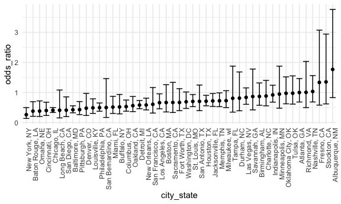
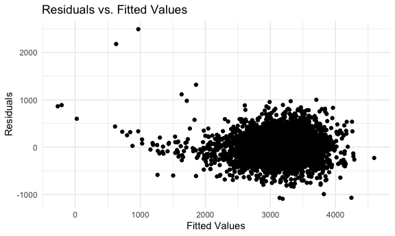
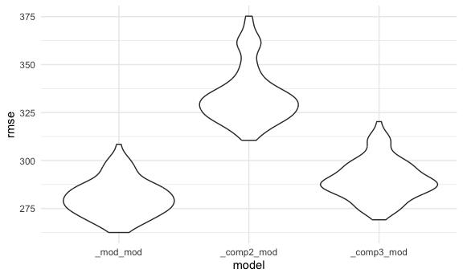

P8105 Homework 6
================
Shehzrin Shah
2024-11-19

# Problem 1

Import the 2017 Central Park weather data.

``` r
weather_df = 
  rnoaa::meteo_pull_monitors(
    c("USW00094728"),
    var = c("PRCP", "TMIN", "TMAX"), 
    date_min = "2017-01-01",
    date_max = "2017-12-31") %>%
  mutate(
    name = recode(id, USW00094728 = "CentralPark_NY"),
    tmin = tmin / 10,
    tmax = tmax / 10) %>%
  select(name, id, everything())
```

    ## using cached file: /Users/shehzrin/Library/Caches/org.R-project.R/R/rnoaa/noaa_ghcnd/USW00094728.dly

    ## date created (size, mb): 2024-09-26 10:19:43.784363 (8.651)

    ## file min/max dates: 1869-01-01 / 2024-09-30

Use 5,000 bootstrap samples, and for each bootstrap sample, produce
estimates of r-squared and log(betahat0 \* betahat1).

``` r
bootstrap_rsq = function(lm) {
  r_squared = lm |>
    broom::glance() |>
    pull(r.squared)
  return(r_squared)
}

bootstrap_log = function(lm) {
  log_beta_product = lm |>
    broom::tidy() |>
    pull(estimate) |>
    prod() |>
    log()
  return(log_beta_product)
}

bootstrap_results = weather_df |>
  modelr::bootstrap(n = 5000) |>
  mutate(
    models = map(strap, \(df) lm(tmax ~ tmin, data = df)),
    r_squared = map(models, bootstrap_rsq),
    log_beta_product = map(models, bootstrap_log)
  ) |>
  select(-strap, -models, -.id) |>
  unnest(r_squared) |>
  unnest(log_beta_product)
```

Plot the distribution of these estimates.

``` r
ggplot(bootstrap_results, aes(x = r_squared)) +
  geom_histogram(binwidth = 0.01, fill = "blue", alpha = 0.7) +
  labs(title = "Bootstrap Distribution of R-squared", x = "R-squared", y = "Frequency")
```


The bootstrap distribution of `r-squared` is unimodal and slightly
skewed left. Most values lie between 0.89 and 0.93 (with peak frequency
of about 0.91), suggesting a high proportion of the variance in `tmax`
is explained by `tmin` in the regression model.

Plot the distribution of these estimates.

``` r
ggplot(bootstrap_results, aes(x = log_beta_product)) +
  geom_histogram(binwidth = 0.01, fill = "red", alpha = 0.7) +
  labs(title = "Bootstrap Distribution of Log Beta Product", x = "Log Beta Product", y = "Frequency")
```


The bootstrap distribution of `log_beta_product` is approximately
symmetric (roughly normal distribution) and centered around 2.02 (mostly
ranging from 1.95 and 2.05).

Using the 5,000 bootstrap estimates, identify the 2.5% and 97.5%
quantiles to produce a 95% confidence interval (CI) for `r-squared` and
`log_beta_product`.

``` r
bootstrap_results |>
  summarize(
    ci_lower_log_beta_product = quantile(log_beta_product, 0.025),
    ci_upper_log_beta_product = quantile(log_beta_product, 0.975),
    ci_lower_r_squared = quantile(r_squared, 0.025),
    ci_upper_r_squared = quantile(r_squared, 0.975)
  ) |>
  knitr::kable(digits = 4)
```

| ci_lower_log_beta_product | ci_upper_log_beta_product | ci_lower_r_squared | ci_upper_r_squared |
|--------------------------:|--------------------------:|-------------------:|-------------------:|
|                    1.9642 |                    2.0584 |             0.8946 |             0.9271 |

# Problem 2

Create a `city_state` variable and a binary variable indicating whether
the homicide is solved. Omit cities that don’t report victim race and
Tulsa, AL (data entry mistake). Limit analysis to those for whom
`victim_race` is `white` or `black`. Be sure `victim_age` is numeric.

``` r
homicide_df = 
  read_csv("homicide-data.csv", na = c("", "NA", "Unknown")) |>
  mutate(
    city_state = str_c(city, state, sep = ", "),
    victim_age = as.numeric(victim_age),
    resolution = case_when(
      disposition == "Closed without arrest" ~ 0,
      disposition == "Open/No arrest"        ~ 0,
      disposition == "Closed by arrest"      ~ 1)
  ) |> 
  filter(victim_race %in% c("White", "Black")) |> 
  filter(!(city_state %in% c("Dallas, TX", "Phoenix, AZ", "Kansas City, MO", "Tulsa, AL"))) |> 
  select(city_state, resolution, victim_age, victim_sex, victim_race)
```

    ## Rows: 52179 Columns: 12
    ## ── Column specification ────────────────────────────────────────────────────────
    ## Delimiter: ","
    ## chr (8): uid, victim_last, victim_first, victim_race, victim_sex, city, stat...
    ## dbl (4): reported_date, victim_age, lat, lon
    ## 
    ## ℹ Use `spec()` to retrieve the full column specification for this data.
    ## ℹ Specify the column types or set `show_col_types = FALSE` to quiet this message.

For Baltimore, MD, use the `glm` function to fit a logistic regression
with resolved vs unresolved as the outcome and victim age, sex, and race
as predictors. Obtain the estimate and CI of the adjusted **odds ratio**
(OR) for solving homicides comparing male victims to female victims
keeping all other variables fixed.

``` r
baltimore_glm = 
  filter(homicide_df, city_state == "Baltimore, MD") |> 
  glm(resolution ~ victim_age + victim_sex + victim_race, family = binomial(), data = _)

baltimore_glm |> 
  broom::tidy() |> 
  mutate(
    odds_ratio = exp(estimate), 
    ci_upper_odds_ratio = exp(estimate + 1.96 * std.error),
    ci_lower_odds_ratio = exp(estimate - 1.96 * std.error)) |>
  filter(term == "victim_sexMale") |> 
  select(odds_ratio, ci_lower_odds_ratio, ci_upper_odds_ratio) |>
  knitr::kable(digits = 3)
```

| odds_ratio | ci_lower_odds_ratio | ci_upper_odds_ratio |
|-----------:|--------------------:|--------------------:|
|      0.426 |               0.325 |               0.558 |

Run `glm` for each of the cities in your dataset, and extract the
adjusted odds ratio (and CI) for solving homicides comparing male
victims to female victims. Create a dataframe with estimated ORs and CIs
for each city.

``` r
allcities_glm = 
  homicide_df |> 
  nest(data = -city_state) |> 
  mutate(
    models = map(data, \(df) glm(resolution ~ victim_age + victim_sex + victim_race, family = binomial(), data = df)),
  tidy_models = map(models, broom::tidy)) |> 
  select(-models, -data) |> 
  unnest(cols = tidy_models) |> 
  mutate(
    odds_ratio = exp(estimate), 
    ci_upper_odds_ratio = exp(estimate + 1.96 * std.error),
    ci_lower_odds_ratio = exp(estimate - 1.96 * std.error)) |> 
  filter(term == "victim_sexMale") |> 
  select(city_state, odds_ratio, ci_lower_odds_ratio, ci_upper_odds_ratio)

allcities_glm |>
  knitr::kable(digits = 3)
```

| city_state         | odds_ratio | ci_lower_odds_ratio | ci_upper_odds_ratio |
|:-------------------|-----------:|--------------------:|--------------------:|
| Albuquerque, NM    |      1.767 |               0.831 |               3.761 |
| Atlanta, GA        |      1.000 |               0.684 |               1.463 |
| Baltimore, MD      |      0.426 |               0.325 |               0.558 |
| Baton Rouge, LA    |      0.381 |               0.209 |               0.695 |
| Birmingham, AL     |      0.870 |               0.574 |               1.318 |
| Boston, MA         |      0.667 |               0.354 |               1.260 |
| Buffalo, NY        |      0.521 |               0.290 |               0.935 |
| Charlotte, NC      |      0.884 |               0.557 |               1.403 |
| Chicago, IL        |      0.410 |               0.336 |               0.501 |
| Cincinnati, OH     |      0.400 |               0.236 |               0.677 |
| Columbus, OH       |      0.532 |               0.378 |               0.750 |
| Denver, CO         |      0.479 |               0.236 |               0.971 |
| Detroit, MI        |      0.582 |               0.462 |               0.734 |
| Durham, NC         |      0.812 |               0.392 |               1.683 |
| Fort Worth, TX     |      0.669 |               0.397 |               1.127 |
| Fresno, CA         |      1.335 |               0.580 |               3.071 |
| Houston, TX        |      0.711 |               0.558 |               0.907 |
| Indianapolis, IN   |      0.919 |               0.679 |               1.242 |
| Jacksonville, FL   |      0.720 |               0.537 |               0.966 |
| Las Vegas, NV      |      0.837 |               0.608 |               1.154 |
| Long Beach, CA     |      0.410 |               0.156 |               1.082 |
| Los Angeles, CA    |      0.662 |               0.458 |               0.956 |
| Louisville, KY     |      0.491 |               0.305 |               0.790 |
| Memphis, TN        |      0.723 |               0.529 |               0.988 |
| Miami, FL          |      0.515 |               0.304 |               0.872 |
| Milwaukee, wI      |      0.727 |               0.499 |               1.060 |
| Minneapolis, MN    |      0.947 |               0.478 |               1.875 |
| Nashville, TN      |      1.034 |               0.685 |               1.562 |
| New Orleans, LA    |      0.585 |               0.422 |               0.811 |
| New York, NY       |      0.262 |               0.138 |               0.499 |
| Oakland, CA        |      0.563 |               0.365 |               0.868 |
| Oklahoma City, OK  |      0.974 |               0.624 |               1.520 |
| Omaha, NE          |      0.382 |               0.203 |               0.721 |
| Philadelphia, PA   |      0.496 |               0.378 |               0.652 |
| Pittsburgh, PA     |      0.431 |               0.265 |               0.700 |
| Richmond, VA       |      1.006 |               0.498 |               2.033 |
| San Antonio, TX    |      0.705 |               0.398 |               1.249 |
| Sacramento, CA     |      0.669 |               0.335 |               1.337 |
| Savannah, GA       |      0.867 |               0.422 |               1.780 |
| San Bernardino, CA |      0.500 |               0.171 |               1.462 |
| San Diego, CA      |      0.413 |               0.200 |               0.855 |
| San Francisco, CA  |      0.608 |               0.317 |               1.165 |
| St. Louis, MO      |      0.703 |               0.530 |               0.932 |
| Stockton, CA       |      1.352 |               0.621 |               2.942 |
| Tampa, FL          |      0.808 |               0.348 |               1.876 |
| Tulsa, OK          |      0.976 |               0.614 |               1.552 |
| Washington, DC     |      0.691 |               0.469 |               1.018 |

Create a plot that shows the estimated ORs and CIs for each city.
Organize cities according to estimated OR.

``` r
allcities_glm |> 
  mutate(city_state = fct_reorder(city_state, odds_ratio)) |> 
  ggplot(aes(x = city_state, y = odds_ratio)) + 
  geom_point() + 
  geom_errorbar(aes(ymin = ci_lower_odds_ratio, ymax = ci_upper_odds_ratio)) + 
  theme(axis.text.x = element_text(angle = 90, hjust = 1))
```



Nearly all cities have odds ratios that are less than or close to 1.
This suggests that crimes with male victims hold smaller or similar odds
of resolution compared to crimes with female victims, adjusting for
victim age and race. Half of the cities have narrow CI that do not
contain 1. A few cities have higher ORs with wide CIs (variability or
smaller sample sizes). This suggests a significant difference in
resolution rates by sex after adjustment for victim age and race. Cities
with CIs crossing 1 suggest the effect is not statistically significant.

# Problem 3

Load and clean the data for regression analysis.

``` r
birthweight_df = 
  read_csv("birthweight.csv", na = c("", "NA", "Unknown")) |>
  janitor::clean_names() |>
  mutate(babysex = as.factor(babysex),
         frace = as.factor(frace),
         malform = as.factor(malform),
         mrace = as.factor(mrace))
```

    ## Rows: 4342 Columns: 20
    ## ── Column specification ────────────────────────────────────────────────────────
    ## Delimiter: ","
    ## dbl (20): babysex, bhead, blength, bwt, delwt, fincome, frace, gaweeks, malf...
    ## 
    ## ℹ Use `spec()` to retrieve the full column specification for this data.
    ## ℹ Specify the column types or set `show_col_types = FALSE` to quiet this message.

``` r
sum(is.na(birthweight_df))
```

    ## [1] 0

Propose a regression model for birthweight.

``` r
bwt_model = lm(bwt ~ bhead + blength + gaweeks + delwt + smoken + wtgain + malform + ppbmi + babysex + momage + parity, data = birthweight_df)
summary(bwt_model)
```

    ## 
    ## Call:
    ## lm(formula = bwt ~ bhead + blength + gaweeks + delwt + smoken + 
    ##     wtgain + malform + ppbmi + babysex + momage + parity, data = birthweight_df)
    ## 
    ## Residuals:
    ##      Min       1Q   Median       3Q      Max 
    ## -1089.84  -184.84    -6.46   173.32  2489.81 
    ## 
    ## Coefficients:
    ##               Estimate Std. Error t value Pr(>|t|)    
    ## (Intercept) -6165.7658    99.8535 -61.748  < 2e-16 ***
    ## bhead         135.4725     3.5091  38.606  < 2e-16 ***
    ## blength        77.5255     2.0606  37.623  < 2e-16 ***
    ## gaweeks        13.1411     1.4969   8.779  < 2e-16 ***
    ## delwt           3.2391     0.4124   7.855 5.01e-15 ***
    ## smoken         -2.6157     0.5794  -4.515 6.51e-06 ***
    ## wtgain          0.7223     0.5802   1.245 0.213229    
    ## malform1       26.2038    72.3271   0.362 0.717149    
    ## ppbmi         -12.6624     2.5830  -4.902 9.83e-07 ***
    ## babysex2       30.8546     8.6609   3.562 0.000371 ***
    ## momage          6.2850     1.1250   5.586 2.46e-08 ***
    ## parity         83.1155    41.4350   2.006 0.044927 *  
    ## ---
    ## Signif. codes:  0 '***' 0.001 '**' 0.01 '*' 0.05 '.' 0.1 ' ' 1
    ## 
    ## Residual standard error: 279.2 on 4330 degrees of freedom
    ## Multiple R-squared:  0.7035, Adjusted R-squared:  0.7028 
    ## F-statistic: 934.2 on 11 and 4330 DF,  p-value: < 2.2e-16

I selected relevant predictors based on theory including baby attributes
(e.g., `bhead`, `blenghth`), maternal health factors (e.g., `delwt`,
`smoke`), and pregnancy history (e.g., `parity`, `malform`). I used a
linear regression model that it fitted to predict birthweight (`bwt`).

Plot of model residuals against fitted values.

``` r
birthweight_df |>
  modelr::add_predictions(bwt_model) |> 
  modelr::add_residuals(bwt_model) |> 
  ggplot(aes(x = pred, y = resid)) + 
  geom_point() + 
  labs(title = "Residuals vs. Fitted Values",
       x = "Fitted Values",
       y = "Residuals") 
```



Compare original model to one using length at birth and gestational age
as predictors and to one using head circumference, length, sex, and all
interactions between these.

``` r
bwtmodel_2 = lm(bwt ~ gaweeks + blength, data = birthweight_df)
bwtmodel_3 = lm(bwt ~ bhead + blength + babysex + bhead * blength + bhead * babysex + blength * babysex + bhead * blength * babysex, data = birthweight_df)

cv_df = crossv_mc(birthweight_df, n = 100) |>
  mutate(
    train = map(train, as_tibble),
    test = map(test, as_tibble)) |>
  mutate(
    mod_mod = map(train, ~lm(bwt ~ bhead + blength + gaweeks + delwt + smoken + wtgain + malform + ppbmi + babysex + momage + parity, data = .x)),
    comp2_mod = map(train, ~lm(bwt ~ gaweeks + blength, data = .x)),
    comp3_mod = map(train, ~lm(bwt ~ bhead + blength + babysex + bhead * blength + bhead * babysex + blength * babysex + bhead * blength * babysex, data = .x))
  ) |>
  mutate(
    rmse_mod_mod = map2_dbl(mod_mod, test, ~rmse(model = .x, data = .y)),
    rmse_comp2_mod = map2_dbl(comp2_mod, test, ~rmse(model = .x, data = .y)),
    rmse_comp3_mod = map2_dbl(comp3_mod, test, ~rmse(model = .x, data = .y))
  )

cv_df |> 
  summarise(mod1_mean_error = mean(rmse_mod_mod),
            mod2_mean_error = mean(rmse_comp2_mod),
            mod3_mean_error = mean(rmse_comp3_mod)) |>
  knitr::kable(digits = 3)
```

| mod1_mean_error | mod2_mean_error | mod3_mean_error |
|----------------:|----------------:|----------------:|
|         280.798 |         334.066 |         290.102 |

``` r
cv_df |>
  select(starts_with("rmse")) |>
  pivot_longer(
    everything(),
    names_to = "model",
    values_to = "rmse",
    names_prefix = "rmse") |>
  mutate(model = fct_inorder(model)) |>
  ggplot(aes(x = model, y = rmse)) + 
  geom_violin()
```



Model 1 (original model) shows the lowest RMSE among the 3 models (most
accurate predictions for birthweight). Its RMSE distribution is also
narrower (most consistent predictions across cross-val folds). Model 2
(gestational age + length) is simpler and has a higher average RMSE
compared to Model 1. It explains less variation in birthweight. Its
wider RMSE distribution also suggests less reliable performance. Model 3
(head circumference + length + sex + interactions) has a RMSE higher
than Model 1 but comparable to Model 2. Even with the interaction terms,
it does not do better than Model 1 (maybe because interactions are not
adding as much predictive power). The RMSE distribution is slightly
wider than Model 1 but narrower than Model 2.
