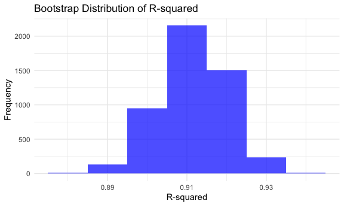
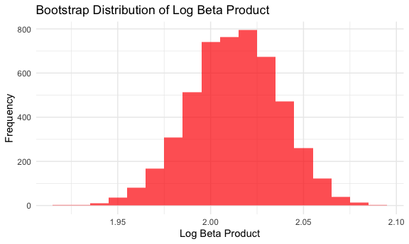

P8105 Homework 6
================
Shehzrin Shah
2024-11-19

# Problem 1

Import the 2017 Central Park weather data.

``` r
weather_df = 
  rnoaa::meteo_pull_monitors(
    c("USW00094728"),
    var = c("PRCP", "TMIN", "TMAX"), 
    date_min = "2017-01-01",
    date_max = "2017-12-31") %>%
  mutate(
    name = recode(id, USW00094728 = "CentralPark_NY"),
    tmin = tmin / 10,
    tmax = tmax / 10) %>%
  select(name, id, everything())
```

    ## using cached file: /Users/shehzrin/Library/Caches/org.R-project.R/R/rnoaa/noaa_ghcnd/USW00094728.dly

    ## date created (size, mb): 2024-09-26 10:19:43.784363 (8.651)

    ## file min/max dates: 1869-01-01 / 2024-09-30

Use 5,000 bootstrap samples, and for each bootstrap sample, produce
estimates of r-squared and log(betahat0 \* betahat1).

``` r
bootstrap_rsq = function(lm) {
  r_squared = lm |>
    broom::glance() |>
    pull(r.squared)
  return(r_squared)
}

bootstrap_log = function(lm) {
  log_beta_product = lm |>
    broom::tidy() |>
    pull(estimate) |>
    prod() |>
    log()
  return(log_beta_product)
}

bootstrap_results = weather_df |>
  modelr::bootstrap(n = 5000) |>
  mutate(
    models = map(strap, \(df) lm(tmax ~ tmin, data = df)),
    r_squared = map(models, bootstrap_rsq),
    log_beta_product = map(models, bootstrap_log)
  ) |>
  select(-strap, -models, -.id) |>
  unnest(r_squared) |>
  unnest(log_beta_product)
```

Plot the distribution of these estimates.

``` r
ggplot(bootstrap_results, aes(x = r_squared)) +
  geom_histogram(binwidth = 0.01, fill = "blue", alpha = 0.7) +
  labs(title = "Bootstrap Distribution of R-squared", x = "R-squared", y = "Frequency")
```



The bootstrap distribution of `r-squared` is unimodal \_\_\_\_. Most
values lie between 0.89 and 0.93 (with peak frequency of about 0.91),
suggesting a high proportion of the variance in `tmax` is explained by
`tmin` in the regression model.

Plot the distribution of these estimates.

``` r
ggplot(bootstrap_results, aes(x = log_beta_product)) +
  geom_histogram(binwidth = 0.01, fill = "red", alpha = 0.7) +
  labs(title = "Bootstrap Distribution of Log Beta Product", x = "Log Beta Product", y = "Frequency")
```



The bootstrap distribution of `log_beta_product` is approximately
symmetric (roughly normal distribution) and centered around 2.02.

Using the 5,000 bootstrap estimates, identify the 2.5% and 97.5%
quantiles to produce a 95% confidence interval (CI) for `r-squared` and
`log_beta_product`.

``` r
bootstrap_results |>
  summarize(
    ci_lower_log_beta_product = quantile(log_beta_product, 0.025),
    ci_upper_log_beta_product = quantile(log_beta_product, 0.975),
    ci_lower_r_squared = quantile(r_squared, 0.025),
    ci_upper_r_squared = quantile(r_squared, 0.975)
  ) |>
  knitr::kable(digits = 4)
```

| ci_lower_log_beta_product | ci_upper_log_beta_product | ci_lower_r_squared | ci_upper_r_squared |
|--------------------------:|--------------------------:|-------------------:|-------------------:|
|                    1.9642 |                    2.0584 |             0.8946 |             0.9271 |
